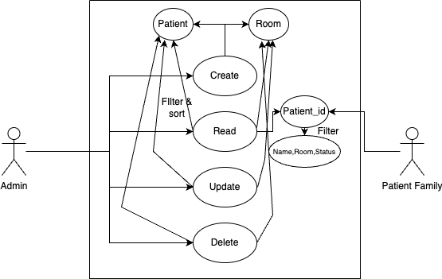
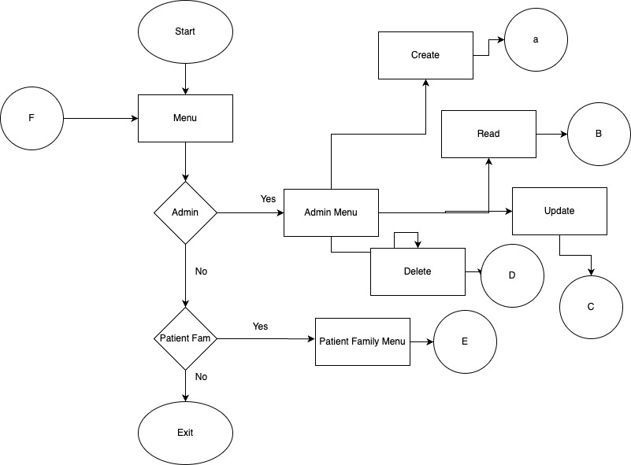
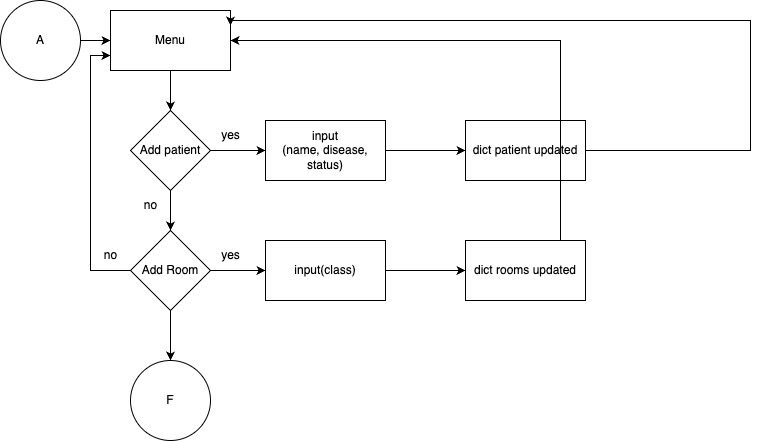
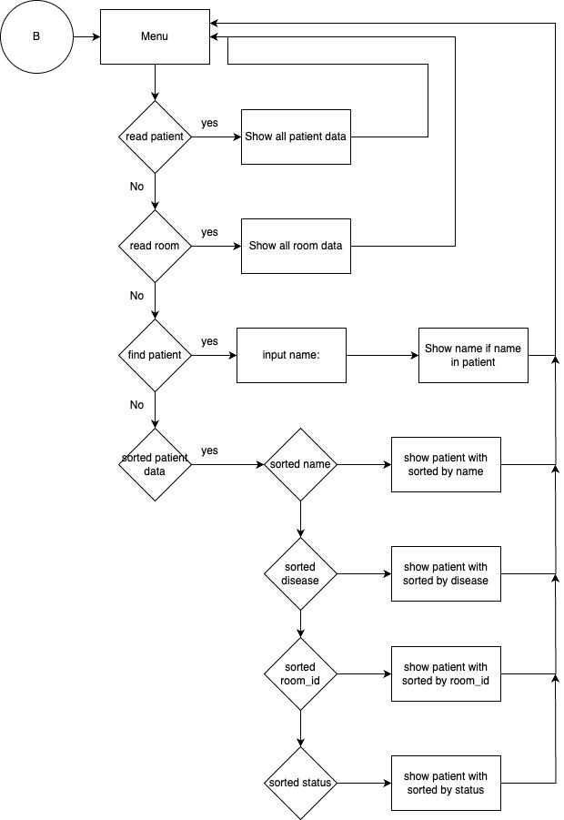
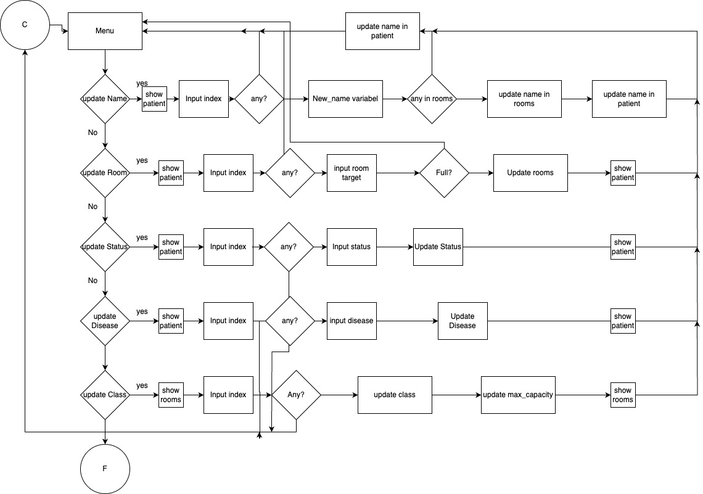
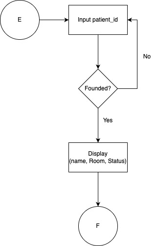

Name : MUCHAMMAD FAHD ISHAMUDDIN
PROGRAM : DTI DS PURWADHIKA
Lecturer : Ilham Candra
### Topic : Hospital System
---
Hospital system
have 2 dictionary (patient, room)
patient have name, room, patient_id, disease, status
room have class, max capacity, occupant(list)
have 2 actor (family and admin) admin was super user
family only can read
1. add patient : add new data patient
2. add room Hospital : add new room in hospital
3. display patient : show all patient
4. display room : show all room in hospital include occupant
5. find patient by name : filtering of patient data by name
6. sort patient by anything : sorting data based on column
7. update name new data patient : update name of patient, selected index
8. update room new data patient : update room of patient, selected index
9. update status patient : update status of patient, selected by index
10. update disease patient : update disease of patient, selected by index
11. update class on rooms : update class(max capacity), can update if no occupants
12. del patient : del patient, reset index
13. del room : del room, reset index
14. new role as family : second role, as family of patient
15. find data by patient_id : only show name, room and status, filtering by patid.
***
Usecase: 
---

Flowchart
---
1. Main Guide

2. Add Data

3. Read Data

4. Update Data

5. Delete Data

6. Patient Family find

